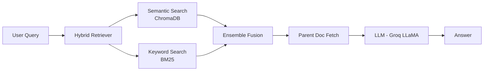

# Finance RAG Assistant 💰

A production-ready Retrieval-Augmented Generation (RAG) system for financial question answering, built with LangChain, ChromaDB, and Groq LLaMA.

## Features

- **Hybrid Search**: Combines semantic embeddings (ChromaDB) with keyword-based search (BM25) for optimal retrieval
- **Multi-turn Conversations**: Parent-child document structure preserves conversation context
- **Structured Metadata**: Preserves question-answer pairs with system prompts and conversation IDs
- **MMR Retrieval**: Maximal Marginal Relevance ensures diverse, non-redundant results
- **Interactive UI**: Streamlit-based interface with configurable retrieval settings

## Architecture



## Quick Start

### Prerequisites

- Python 3.8+
- Groq API Key ([Get one free](https://console.groq.com))

### Installation

```bash
# Clone the repository
git clone https://github.com/yourusername/Finance-Instruct-rag.git
cd Finance-Instruct-rag

# Install dependencies
pip install -r requirements.txt

# Set up environment variables
cp .env.example .env
# Edit .env and add your GROQ_API_KEY
```

### Data Ingestion

```bash
# Download dataset (100 samples for testing, remove --limit for full dataset)
python3 ingest/download_dataset.py --limit 100

# Process data
python3 ingest/clean_dataset.py
python3 ingest/chunk_dataset.py
python3 ingest/embed_chunks.py
```

### Run the App

```bash
streamlit run app.py
```

Navigate to `http://localhost:8501` and start asking financial questions!

## Usage Examples

**Simple Questions** (benefiting from hybrid search):

- "What is the difference between stocks and bonds?"
- "What is P/E ratio?"

**Complex Questions** (benefiting from semantic search):

- "Explain the tradeoffs between fiscal and monetary policy as economic tools"
- "How do interest rates affect bond prices?"

## Configuration

### Retrieval Settings

In the Streamlit sidebar, you can configure:

- **Documents to Retrieve**: Number of context documents (1-10)
- **Hybrid Search**: Toggle BM25 + semantic fusion
- **Semantic Weight**: Balance between semantic (0.0) and keyword (1.0) search
- **Full Conversation Context**: Show multi-turn conversation threads

### Recommended Settings

- **Semantic Weight**: 0.5-0.7 for most queries
- **k (documents)**: 3-5 for optimal balance
- **Hybrid Search**: Enabled for better results on simple queries

## Dataset

Uses [Finance-Instruct-500k](https://huggingface.co/datasets/Josephgflowers/Finance-Instruct-500k), a comprehensive dataset of financial Q&A pairs with:

- 500k+ instruction-tuning examples
- Multi-turn conversations
- Diverse financial topics
- XBRL-tagged data

## Technical Stack

- **LLM**: Groq (LLaMA 3.3 70B)
- **Vector DB**: ChromaDB
- **Embeddings**: `sentence-transformers/all-MiniLM-L6-v2`
- **Keyword Search**: BM25 (rank_bm25)
- **Framework**: LangChain
- **UI**: Streamlit

## Project Structure

```
Finance-Instruct-rag/
├── app.py                  # Streamlit application
├── ingest/                 # Data ingestion pipeline
│   ├── download_dataset.py # Download from HuggingFace
│   ├── clean_dataset.py    # Create parent/child docs
│   ├── chunk_dataset.py    # Text chunking
│   └── embed_chunks.py     # Generate embeddings & BM25 index
├── requirements.txt        # Python dependencies
├── .env.example           # Environment template
└── README.md              # This file
```

## Advanced Features

### Parent Document Retrieval

The system uses a two-tier document structure:

- **Child docs**: Individual Q&A pairs (precise retrieval)
- **Parent docs**: Full conversation threads (rich context)

When a query matches a child document, the full parent conversation is retrieved for comprehensive context.

### Hybrid Search

Combines two complementary retrieval methods:

1. **Semantic**: Dense embeddings for conceptual matching
2. **BM25**: Keyword-based for exact term matching

Results are fused using configurable weights for optimal performance.

## Performance Tips

- Use **hybrid search** for short, direct questions
- Use **semantic only** for complex, conceptual queries
- Increase **k** for broad exploration, decrease for precision
- Adjust **semantic weight** based on query type

## License

MIT

## Acknowledgments

- Dataset: [Josephgflowers/Finance-Instruct-500k](https://huggingface.co/datasets/Josephgflowers/Finance-Instruct-500k)
- Inspired by: [EpsteinFiles-RAG](https://github.com/AnkitNayak-eth/EpsteinFiles-RAG)
